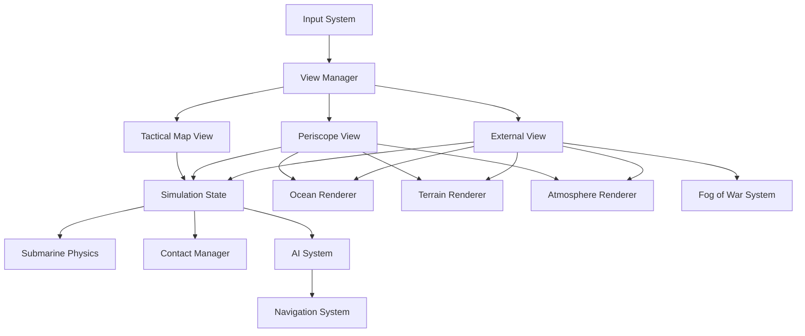

# Design Document: Tactical Submarine Simulator

## Overview

The Tactical Submarine Simulator is a strategic command game built in Godot 4.6 that provides players with three distinct views of submarine operations: a 2D tactical map for strategic command, a 3D periscope view for visual observation, and a 3D external view for tactical awareness. The system emphasizes realistic ocean simulation, environmental rendering, and AI-driven threats while maintaining high performance across Mac M3 and Ubuntu platforms.

The architecture separates concerns into distinct subsystems: view management, simulation state, rendering systems (ocean, terrain, atmosphere), AI behavior, and input handling. All views share a single authoritative simulation state, ensuring consistency when switching between perspectives.

## Architecture

### High-Level Architecture



### Core Subsystems

1. **View Manager**: Handles switching between tactical map, periscope, and external views. Manages camera activation and UI visibility.

2. **Simulation State**: Authoritative source of truth for submarine position, speed, depth, heading, and all contact positions. Updated at fixed timestep.

3. **Rendering Systems**: Ocean, terrain, and atmosphere renderers that operate independently but query simulation state for positioning.

4. **AI System**: Manages behavior of air patrols and surface contacts using state machines and navigation agents.

5. **Fog of War System**: Determines visibility of contacts in external view based on detection and identification status.

## Components and Interfaces

### View Manager

**Responsibility**: Coordinate view transitions and maintain simulation consistency.

**Interface**:
```gdscript
class_name ViewManager extends Node

enum ViewType { TACTICAL_MAP, PERISCOPE, EXTERNAL }

var current_view: ViewType
var tactical_map_camera: Camera2D
var periscope_camera: Camera3D
var external_camera: Camera3D

func switch_to_view(view: ViewType) -> void
func get_active_camera() -> Node
```

**Behavior**:
- Deactivates current camera and UI elements
- Activates target camera and associated UI
- Maintains simulation state during transition
- Completes transitions within 100ms (6 frames at 60 FPS)

### Simulation State

**Responsibility**: Maintain authoritative game state and synchronize all views.

**Interface**:
```gdscript
class_name SimulationState extends Node

# Submarine state
var submarine_position: Vector3
var submarine_velocity: Vector3
var submarine_depth: float
var submarine_heading: float
var submarine_speed: float

# Contact tracking
var contacts: Array[Contact]

func update_submarine_command(waypoint: Vector3, speed: float, depth: float) -> void
func add_contact(contact: Contact) -> void
func update_contact(contact_id: int, position: Vector3, detected: bool, identified: bool) -> void
func get_visible_contacts(observer_position: Vector3) -> Array[Contact]
```

**Behavior**:
- Updates at fixed 60 Hz timestep
- Applies physics calculations to submarine
- Propagates state changes to all views
- Maintains contact detection and identification status

### Contact

**Responsibility**: Represent detected entities with position and detection metadata.

**Interface**:
```gdscript
class_name Contact extends Resource

enum ContactType { SURFACE_SHIP, AIRCRAFT, SUBMARINE }

var id: int
var type: ContactType
var position: Vector3
var velocity: Vector3
var detected: bool
var identified: bool
var bearing: float
var range: float
```

### Tactical Map View

**Responsibility**: Provide 2D strategic interface for command and control.

**Interface**:
```gdscript
class_name TacticalMapView extends CanvasLayer

var simulation_state: SimulationState

func display_submarine_position(pos: Vector2) -> void
func display_contacts(contacts: Array[Contact]) -> void
func handle_waypoint_input(screen_pos: Vector2) -> void
func handle_speed_input(speed: float) -> void
func handle_depth_input(depth: float) -> void
```

**Behavior**:
- Converts 3D simulation positions to 2D map coordinates
- Renders submarine icon with heading indicator
- Renders contact icons with bearing arcs
- Processes mouse clicks for waypoint placement
- Updates UI controls for speed and depth

### Periscope View

**Responsibility**: Provide first-person view from submarine mast with realistic lens effects.

**Interface**:
```gdscript
class_name PeriscopeView extends Node3D

var camera: Camera3D
var simulation_state: SimulationState
var zoom_level: float
var rotation: float

func update_camera_position() -> void
func handle_rotation_input(delta_rotation: float) -> void
func handle_zoom_input(delta_zoom: float) -> void
func apply_lens_effects() -> void
```

**Behavior**:
- Positions camera at submarine mast position
- Applies rotation based on player input
- Adjusts field of view for zoom (15° to 90°)
- Applies shader effects: distortion, chromatic aberration, vignette
- Switches to underwater rendering when below periscope depth

### External View

**Responsibility**: Provide third-person tactical view with fog-of-war visibility.

**Interface**:
```gdscript
class_name ExternalView extends Node3D

var camera: Camera3D
var simulation_state: SimulationState
var fog_of_war: FogOfWarSystem
var camera_distance: float
var camera_tilt: float
var camera_rotation: float
var free_camera_mode: bool

func update_camera_position() -> void
func handle_tilt_input(delta_tilt: float) -> void
func handle_rotation_input(delta_rotation: float) -> void
func handle_distance_input(delta_distance: float) -> void
func toggle_free_camera() -> void
```

**Behavior**:
- Orbits camera around submarine position (or free position)
- Clamps tilt angle (-89° to 89°)
- Adjusts distance (10m to 500m)
- Queries fog-of-war system for contact visibility
- Renders only identified contacts

### Fog of War System

**Responsibility**: Determine which contacts should be visible in external view.

**Interface**:
```gdscript
class_name FogOfWarSystem extends Node

func is_contact_visible(contact: Contact) -> bool
func update_visibility(contacts: Array[Contact]) -> void
```

**Behavior**:
- Returns true only if contact is both detected AND identified
- Always allows terrain, ocean, and atmosphere to be visible
- Updates visibility flags based on simulation state

### Ocean Renderer

**Responsibility**: Render realistic ocean surface using FFT-based wave simulation.

**Interface**:
```gdscript
class_name OceanRenderer extends Node3D

var ocean_mesh: MeshInstance3D
var wave_spectrum: Texture2D
var foam_texture: Texture2D

func generate_wave_spectrum(wind_speed: float, wind_direction: Vector2) -> void
func update_waves(delta: float) -> void
func get_wave_height(position: Vector2) -> float
func apply_buoyancy(body: RigidBody3D) -> void
```

**Behavior**:
- Generates FFT-based wave heightfield from Phillips spectrum
- Computes Jacobian for foam generation
- Renders caustics using animated projection
- Applies refraction for underwater viewing
- Provides wave height queries for buoyancy calculations
- Uses CDLOD (Continuous Distance-Dependent Level of Detail) for mesh

**Implementation Notes**:
- Based on [Tessier-Ashpool FFT ocean implementation](https://github.com/tessarakkt/godot4-oceanfft)
- Wave spectrum parameters: wind speed, fetch length, gravity constant
- Foam threshold based on Jacobian determinant
- Caustics use scrolling normal map projection

### Terrain Renderer

**Responsibility**: Generate and render procedural coastal and sea floor terrain.

**Interface**:
```gdscript
class_name TerrainRenderer extends Node3D

var heightmap: Image
var terrain_mesh: MeshInstance3D
var collision_shape: CollisionShape3D

func generate_heightmap(seed: int, size: Vector2i) -> void
func update_lod(camera_position: Vector3) -> void
func get_height_at(position: Vector2) -> float
```

**Behavior**:
- Generates heightmap using Perlin/Simplex noise
- Creates collision geometry from heightmap
- Implements LOD system with multiple detail levels
- Applies parallax occlusion mapping shader
- Provides height queries for collision detection

**Implementation Notes**:
- Uses Terrain3D addon for heightmap management
- LOD levels: 4 (high detail near camera, low detail far away)
- Chunk size: 64x64 vertices
- Parallax steps: 16 for quality, 8 for performance

### Atmosphere Renderer

**Responsibility**: Render sky, clouds, and atmospheric effects.

**Interface**:
```gdscript
class_name AtmosphereRenderer extends WorldEnvironment

var sky_material: ProceduralSkyMaterial
var volumetric_fog: FogVolume
var time_of_day: float

func update_time_of_day(delta: float) -> void
func set_cloud_coverage(coverage: float) -> void
```

**Behavior**:
- Updates sun position based on time of day
- Renders volumetric clouds with dynamic movement
- Applies god rays when sun is visible
- Configures SDFGI for global illumination
- Applies screen-space reflections

**Implementation Notes**:
- Day-night cycle: 20 minute real-time = 24 hour game-time
- Cloud movement: wind-driven with Perlin noise
- SDFGI cascade count: 4 for large scenes
- SSR enabled with fade-in for smooth transitions

### Submarine Physics

**Responsibility**: Simulate submarine movement, buoyancy, and hydrodynamics.

**Interface**:
```gdscript
class_name SubmarinePhysics extends Node

var submarine_body: RigidBody3D
var ocean_renderer: OceanRenderer
var target_depth: float
var target_speed: float

func apply_buoyancy(delta: float) -> void
func apply_drag(delta: float) -> void
func apply_propulsion(delta: float) -> void
func apply_depth_control(delta: float) -> void
```

**Behavior**:
- Queries ocean renderer for wave height at submarine position
- Applies buoyancy force based on displacement and depth
- Applies drag proportional to velocity squared
- Limits turning rate based on speed
- Simulates ballast tank behavior for depth changes

**Physics Parameters**:
- Mass: 8000 tons
- Drag coefficient: 0.04
- Max speed: 20 knots (10.3 m/s)
- Max depth: 400 meters
- Depth change rate: 5 m/s
- Turn rate: 3°/s at full speed, 10°/s at slow speed

### AI System

**Responsibility**: Control behavior of air patrols and surface contacts.

**Interface**:
```gdscript
class_name AISystem extends Node

var ai_agents: Array[AIAgent]
var navigation_system: NavigationSystem

func spawn_air_patrol(position: Vector3, patrol_route: Array[Vector3]) -> void
func update_agents(delta: float) -> void
```

### AIAgent

**Responsibility**: Individual AI entity with state machine behavior.

**Interface**:
```gdscript
class_name AIAgent extends Node3D

enum State { PATROL, SEARCH, ATTACK }

var current_state: State
var navigation_agent: NavigationAgent3D
var detection_range: float
var attack_range: float
var target: Node3D

func transition_to_state(new_state: State) -> void
func update_patrol() -> void
func update_search() -> void
func update_attack() -> void
```

**Behavior**:
- **Patrol State**: Follows waypoint route, scans for submarine
- **Search State**: Investigates last known submarine position
- **Attack State**: Approaches submarine and executes attack pattern

**State Transitions**:
- Patrol → Search: Submarine detected within detection range
- Search → Attack: Submarine within attack range
- Attack → Search: Submarine leaves attack range
- Search → Patrol: Search timeout (60 seconds)

**Implementation Notes**:
- Detection range: 2000m for aircraft, 5000m for radar
- Attack range: 500m for dipping sonar
- Navigation uses NavigationAgent3D with NavigationRegion3D
- Contrails rendered using GPUParticles3D

### Input System

**Responsibility**: Process player input and route to appropriate handlers.

**Interface**:
```gdscript
class_name InputSystem extends Node

var view_manager: ViewManager
var current_view: Node

func _input(event: InputEvent) -> void
func handle_view_toggle(view_type: ViewManager.ViewType) -> void
func handle_tactical_input(event: InputEvent) -> void
func handle_periscope_input(event: InputEvent) -> void
func handle_external_input(event: InputEvent) -> void
```

**Input Mappings**:
- View Toggle: Tab (cycle views), 1 (tactical), 2 (periscope), 3 (external)
- Tactical Map: Left click (waypoint), Mouse wheel (zoom), W/S (speed), Q/E (depth)
- Periscope: Mouse move (rotate), Mouse wheel (zoom)
- External: Mouse drag (rotate), Mouse wheel (distance), Shift+Mouse drag (tilt), F (toggle free camera)

### Audio System

**Responsibility**: Play spatial and ambient audio based on simulation state.

**Interface**:
```gdscript
class_name AudioSystem extends Node

var sonar_ping_player: AudioStreamPlayer3D
var propeller_player: AudioStreamPlayer3D
var ambient_player: AudioStreamPlayer

func play_sonar_ping(position: Vector3) -> void
func update_propeller_sound(speed: float) -> void
func update_ambient_sound(sea_state: int) -> void
```

**Behavior**:
- Plays sonar ping at contact position when detected
- Adjusts propeller volume and pitch based on submarine speed
- Plays ambient wave sounds based on sea state (0-9 scale)
- Spatializes 3D sounds relative to active camera

## Data Models

### Submarine State

```gdscript
class_name SubmarineState extends Resource

var position: Vector3
var velocity: Vector3
var heading: float  # 0-360 degrees
var depth: float    # meters below surface
var speed: float    # meters per second
var target_waypoint: Vector3
var target_depth: float
var target_speed: float
```

### Contact Data

```gdscript
class_name ContactData extends Resource

var id: int
var type: Contact.ContactType
var position: Vector3
var velocity: Vector3
var heading: float
var detected: bool
var identified: bool
var detection_time: float
var last_update_time: float
```

### Wave Spectrum Data

```gdscript
class_name WaveSpectrumData extends Resource

var wind_speed: float       # m/s
var wind_direction: Vector2 # normalized
var fetch_length: float     # meters
var spectrum_texture: Texture2D
var displacement_texture: Texture2D
var normal_texture: Texture2D
```

### AI Patrol Route

```gdscript
class_name PatrolRoute extends Resource

var waypoints: Array[Vector3]
var loop: bool
var patrol_speed: float
```

## Correctness Properties

*A property is a characteristic or behavior that should hold true across all valid executions of a system—essentially, a formal statement about what the system should do. Properties serve as the bridge between human-readable specifications and machine-verifiable correctness guarantees.*

### Property 1: Tactical Map Display Completeness

*For any* submarine state, the tactical map display should contain the submarine's position, course, speed, and depth information.

**Validates: Requirements 1.1**

### Property 2: Waypoint Course Update

*For any* submarine position and waypoint position, setting the waypoint should result in the submarine's course being updated to point toward the waypoint.

**Validates: Requirements 1.2**

### Property 3: Submarine Control Input Clamping

*For any* speed or depth input value, the resulting submarine speed should be clamped to [0, max_speed] and depth should be clamped to [0, max_depth].

**Validates: Requirements 1.3, 1.4**

### Property 4: Contact Display Completeness

*For any* set of detected contacts, the tactical map should display all contacts with their bearing and range information.

**Validates: Requirements 1.5**

### Property 5: Sonar Range Detection Display

*For any* contact within sonar range, the sonar system should display that contact's bearing arc on the tactical map.

**Validates: Requirements 2.1**

### Property 6: Contact Visual Distinction

*For any* set of multiple detected contacts, each contact should have a distinct visual indicator that differentiates it from other contacts.

**Validates: Requirements 2.2**

### Property 7: ESM Display for Radar Contacts

*For any* contact emitting radar signals, the sonar system should display ESM bearing information for that contact.

**Validates: Requirements 2.3**

### Property 8: Contact Update Frequency

*For any* contact detection type, contact positions should be updated at intervals appropriate to that detection type (passive sonar: 5s, active sonar: 2s, radar: 1s).

**Validates: Requirements 2.4**

### Property 9: View Toggle Correctness

*For any* current view state and target view (tactical, periscope, or external), activating the view toggle for the target view should result in that view becoming active.

**Validates: Requirements 3.1, 3.2, 3.3**

### Property 10: View Switch State Preservation

*For any* submarine state (position, speed, depth, heading) and any view transition, the submarine state after the transition should equal the submarine state before the transition.

**Validates: Requirements 3.4**

### Property 11: Camera Input Clamping

*For any* camera input (tilt, distance, zoom, rotation), the resulting camera parameter should be clamped to its operational limits (tilt: [-89°, 89°], distance: [10m, 500m], zoom FOV: [15°, 90°]).

**Validates: Requirements 4.2, 4.4, 5.3**

### Property 12: External Camera Orbit Behavior

*For any* rotation input in external view, the camera should maintain its distance from the submarine while changing its angular position around the submarine.

**Validates: Requirements 4.3**

### Property 13: Free Camera Independence

*For any* camera movement input when free camera mode is enabled, the camera position should change independently of the submarine position.

**Validates: Requirements 4.5**

### Property 14: Environmental Visibility Invariance

*For any* game state, the external view should render terrain, ocean, atmosphere, and sealife regardless of detection or identification status.

**Validates: Requirements 4.6**

### Property 15: Fog of War Contact Visibility

*For any* contact, that contact should be rendered in external view if and only if it is both detected AND identified.

**Validates: Requirements 4.7, 4.8**

### Property 16: Periscope Camera Positioning

*For any* submarine state, when periscope view is active, the camera position should be at the submarine's mast position (submarine position + mast height offset).

**Validates: Requirements 5.1**

### Property 17: Periscope Rotation Response

*For any* rotation input in periscope view, the viewing direction should change by an amount proportional to the input magnitude.

**Validates: Requirements 5.2**

### Property 18: Underwater Rendering Activation

*For any* submarine depth greater than periscope depth (10 meters), the periscope view should activate underwater rendering mode.

**Validates: Requirements 5.5**

### Property 19: Wave-Based Buoyancy

*For any* submarine position and wave height at that position, the buoyancy force applied to the submarine should be proportional to the wave height and submarine displacement.

**Validates: Requirements 6.3**

### Property 20: Terrain Collision Prevention

*For any* submarine position that intersects with terrain geometry, the collision system should detect the intersection and apply a collision response that prevents penetration.

**Validates: Requirements 7.3**

### Property 21: Terrain Collision Geometry Completeness

*For any* terrain heightmap, collision geometry should be generated for all terrain features represented in the heightmap.

**Validates: Requirements 7.5**

### Property 22: God Ray Visibility Condition

*For any* time of day, god rays should be rendered if and only if the sun is above the horizon (sun elevation > 0°).

**Validates: Requirements 8.3**

### Property 23: Sealife Culling Rules

*For any* sealife instance, it should be culled (not rendered) if either its distance from the camera exceeds the culling distance OR it is located in an area with foam intensity above the foam threshold.

**Validates: Requirements 9.2, 9.3**

### Property 24: AI Patrol Route Following

*For any* AI patrol with a defined patrol route, the AI should navigate to each waypoint in sequence, moving to the next waypoint when within arrival threshold of the current waypoint.

**Validates: Requirements 10.1**

### Property 25: AI Detection State Transition

*For any* AI patrol in patrol state, when the submarine is detected (within detection range), the AI should transition to search state.

**Validates: Requirements 10.2**

### Property 26: AI Attack Behavior Activation

*For any* AI patrol in search state, when the submarine is within attack range, the AI should transition to attack state and execute attack patterns.

**Validates: Requirements 10.3**

### Property 27: AI Radar Pursuit Behavior

*For any* AI patrol, when the submarine is detected by radar, the AI behavior should update to pursue the submarine's last known position.

**Validates: Requirements 10.5**

### Property 28: Depth-Based Physics Forces

*For any* submarine depth change, the system should apply pressure and buoyancy forces that are functions of the depth (pressure increases linearly with depth, buoyancy depends on displacement).

**Validates: Requirements 11.1**

### Property 29: Thermal Layer Detection Effects

*For any* submarine and contact pair separated by a thermal layer, the sonar detection range should be reduced compared to the detection range without a thermal layer.

**Validates: Requirements 11.2**

### Property 30: Hydrodynamic Drag Application

*For any* submarine velocity and depth, the drag force applied should be proportional to velocity squared and adjusted by depth-dependent water density.

**Validates: Requirements 11.3**

### Property 31: Speed-Dependent Maneuverability

*For any* submarine speed, the maximum turn rate should be inversely proportional to speed (slower speed allows tighter turns).

**Validates: Requirements 11.4**

### Property 32: Surface Wave Interaction

*For any* submarine at surface depth (depth < 5m), the submarine should experience vertical motion that matches the wave height at its position.

**Validates: Requirements 11.5**

### Property 33: Bidirectional State Synchronization

*For any* submarine state change (whether from tactical map command or 3D simulation physics), all views (tactical map, periscope, external) should reflect the updated state.

**Validates: Requirements 12.1, 12.2**

### Property 34: Contact Position Consistency

*For any* contact, the position used by the detection system should equal the position used for visual rendering in all views.

**Validates: Requirements 12.4**

### Property 35: Sonar Detection Audio Trigger

*For any* contact detection event, a sonar ping audio should be played at the contact's position.

**Validates: Requirements 14.1**

### Property 36: Speed-Proportional Propeller Audio

*For any* submarine speed, the propeller audio volume and pitch should be proportional to the speed (higher speed = louder and higher pitch).

**Validates: Requirements 14.2**

### Property 37: Sea State Ambient Audio

*For any* sea state value (0-9 scale), the ambient wave and water sounds should match the intensity of that sea state.

**Validates: Requirements 14.3**

### Property 38: 3D Audio Spatialization

*For any* 3D audio source position and camera position, the audio should be spatialized such that the perceived direction and distance match the geometric relationship between source and camera.

**Validates: Requirements 14.4**

### Property 39: Keyboard Input Response

*For any* keyboard input for speed or depth adjustment, the submarine's target speed or target depth should change by the amount specified by the input binding.

**Validates: Requirements 15.1**

### Property 40: Mouse Waypoint Placement

*For any* mouse click on the tactical map, a waypoint should be set at the world position corresponding to the clicked screen position.

**Validates: Requirements 15.2**

### Property 41: Mouse Periscope Control

*For any* mouse input in periscope view, the periscope rotation or zoom should change according to the input type (mouse movement = rotation, mouse wheel = zoom).

**Validates: Requirements 15.3**

### Property 42: Custom Input Binding Functionality

*For any* customized input binding, the bound action should trigger when the custom input is activated.

**Validates: Requirements 15.4**

### Property 43: Cross-Platform Feature Parity

*For any* feature implemented in the system, that feature should function identically on both Mac M3 and Ubuntu platforms.

**Validates: Requirements 16.4**

### Property 44: Platform-Appropriate File Paths

*For any* configuration or save data file, the file path should use the platform-appropriate directory (Mac: ~/Library/Application Support, Ubuntu: ~/.local/share).

**Validates: Requirements 16.5**

## Error Handling

### View Switching Errors

- **Invalid View State**: If view manager receives an invalid view type, log error and maintain current view
- **Camera Not Found**: If target camera is null during view switch, log error and fall back to tactical map
- **Transition Timeout**: If view transition exceeds 200ms, log warning and complete transition anyway

### Simulation State Errors

- **Invalid Submarine Position**: If submarine position becomes NaN or infinite, reset to last valid position and log error
- **Contact ID Collision**: If duplicate contact ID is added, reject new contact and log warning
- **State Desynchronization**: If views show different submarine positions (difference > 1m), force synchronization from simulation state

### Physics Errors

- **Terrain Penetration**: If submarine penetrates terrain despite collision detection, apply emergency surface force and log error
- **Velocity Overflow**: If submarine velocity exceeds physical limits (> 50 m/s), clamp velocity and log warning
- **Depth Bounds Violation**: If submarine depth < 0 or > max_depth, clamp to bounds and log warning

### AI Errors

- **Navigation Failure**: If AI agent cannot find path to target, switch to direct movement mode and log warning
- **State Machine Deadlock**: If AI remains in same state for > 300 seconds, force transition to patrol state and log error
- **Invalid Target**: If AI target becomes null during pursuit, transition to patrol state

### Rendering Errors

- **Shader Compilation Failure**: If ocean/terrain shader fails to compile, fall back to simple material and log error
- **Texture Loading Failure**: If wave spectrum texture fails to load, use default spectrum and log warning
- **Mesh Generation Failure**: If terrain mesh generation fails, use flat plane and log error

### Input Errors

- **Invalid Input Event**: If input event type is unrecognized, ignore and log warning
- **Input Binding Conflict**: If multiple actions bind to same input, use first binding and log warning
- **Out of Bounds Input**: If mouse click is outside valid map area, ignore and provide visual feedback

### Audio Errors

- **Audio Stream Missing**: If audio file cannot be loaded, skip audio playback and log warning
- **Audio Bus Overflow**: If too many audio sources play simultaneously, prioritize by distance and log warning

## Testing Strategy

### Dual Testing Approach

The testing strategy employs both unit tests and property-based tests to ensure comprehensive coverage:

- **Unit Tests**: Verify specific examples, edge cases, and error conditions for individual components
- **Property-Based Tests**: Verify universal properties hold across all valid inputs using randomized testing

Both approaches are complementary and necessary. Unit tests catch concrete bugs in specific scenarios, while property-based tests verify general correctness across the input space.

### Property-Based Testing Configuration

**Framework**: Use [Gut](https://github.com/bitwes/Gut) testing framework for Godot with custom property-based testing utilities

**Test Configuration**:
- Minimum 100 iterations per property test (due to randomization)
- Each property test must reference its design document property
- Tag format: `# Feature: tactical-submarine-simulator, Property {number}: {property_text}`

**Generator Strategy**:
- Submarine positions: Random Vector3 within world bounds
- Speeds: Random float in [0, max_speed]
- Depths: Random float in [0, max_depth]
- Headings: Random float in [0, 360]
- Contacts: Random arrays of Contact objects with varied types and positions
- Camera inputs: Random values within and beyond operational limits (to test clamping)

### Unit Testing Focus Areas

**Specific Examples**:
- Submarine at origin with waypoint at (100, 0, 100) → course should be 45°
- Speed input of 15 m/s with max_speed 10 m/s → resulting speed should be 10 m/s
- Depth input of -5 m → resulting depth should be 0 m
- View switch from tactical to periscope → periscope camera should be active

**Edge Cases**:
- Submarine exactly at max depth
- Camera tilt exactly at ±89°
- Contact exactly at sonar range boundary
- AI patrol with single waypoint (no loop)
- Submarine at surface during storm conditions

**Integration Points**:
- View manager coordinating with simulation state during view switches
- Ocean renderer providing wave heights to submarine physics
- Fog of war system querying contact detection status
- AI system using navigation agent with terrain collision

**Error Conditions**:
- Invalid view type passed to view manager
- Submarine position becomes NaN
- Contact with duplicate ID added
- AI navigation target unreachable
- Shader compilation failure

### Property Test Examples

**Property 3: Submarine Control Input Clamping**
```gdscript
# Feature: tactical-submarine-simulator, Property 3: Submarine Control Input Clamping
func test_submarine_control_clamping():
    for i in range(100):
        var speed_input = randf_range(-10.0, 30.0)
        var depth_input = randf_range(-50.0, 500.0)
        
        submarine.set_target_speed(speed_input)
        submarine.set_target_depth(depth_input)
        
        assert_true(submarine.speed >= 0.0 and submarine.speed <= submarine.max_speed)
        assert_true(submarine.depth >= 0.0 and submarine.depth <= submarine.max_depth)
```

**Property 10: View Switch State Preservation**
```gdscript
# Feature: tactical-submarine-simulator, Property 10: View Switch State Preservation
func test_view_switch_preserves_state():
    for i in range(100):
        var initial_pos = Vector3(randf_range(-1000, 1000), 0, randf_range(-1000, 1000))
        var initial_speed = randf_range(0, submarine.max_speed)
        var initial_depth = randf_range(0, submarine.max_depth)
        var initial_heading = randf_range(0, 360)
        
        simulation_state.submarine_position = initial_pos
        simulation_state.submarine_speed = initial_speed
        simulation_state.submarine_depth = initial_depth
        simulation_state.submarine_heading = initial_heading
        
        view_manager.switch_to_view(ViewManager.ViewType.PERISCOPE)
        
        assert_vector3_equal(simulation_state.submarine_position, initial_pos)
        assert_almost_equal(simulation_state.submarine_speed, initial_speed, 0.001)
        assert_almost_equal(simulation_state.submarine_depth, initial_depth, 0.001)
        assert_almost_equal(simulation_state.submarine_heading, initial_heading, 0.001)
```

**Property 15: Fog of War Contact Visibility**
```gdscript
# Feature: tactical-submarine-simulator, Property 15: Fog of War Contact Visibility
func test_fog_of_war_visibility():
    for i in range(100):
        var contact = create_random_contact()
        contact.detected = randi() % 2 == 0
        contact.identified = randi() % 2 == 0
        
        var should_be_visible = contact.detected and contact.identified
        var is_visible = fog_of_war.is_contact_visible(contact)
        
        assert_equal(is_visible, should_be_visible)
```

### Test Organization

Tests are organized by subsystem:

- `test_view_manager.gd`: View switching, camera management
- `test_simulation_state.gd`: State updates, synchronization
- `test_submarine_physics.gd`: Movement, buoyancy, drag
- `test_ocean_renderer.gd`: Wave generation, foam, caustics
- `test_terrain_renderer.gd`: Heightmap generation, collision
- `test_ai_system.gd`: State machines, navigation, detection
- `test_fog_of_war.gd`: Visibility rules
- `test_input_system.gd`: Input handling, binding
- `test_audio_system.gd`: Audio triggering, spatialization

### Continuous Testing

- Run all tests before committing changes
- Property tests run with 100 iterations in CI, 1000 iterations for release builds
- Performance tests run separately to measure framerate on target hardware
- Integration tests verify end-to-end scenarios (e.g., complete patrol encounter)
